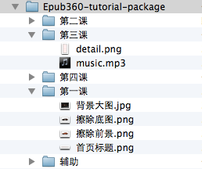

Epub360使用教程
================

Epub360.com是在线使用的交互内容设计平台，无需编程，可在线设计交互式电子杂志、品牌展示、产品指南、培训课件、交互童书、微网页等互动内容，一次创作，可同时发布到iOS、安卓、桌面及微信。

本教程将分5课，围绕制作汽车主题的交互内容，介绍了Epub360常用功能。整个过程需要30分钟左右。

在开始学习本教程内容之前，需要完成以下准备：

- 注册Epub360帐号
- 使用合适的浏览器
- 安装Epub360 IPad APP
- 下载素材包

### Epub360帐号

请首先确保自己有一个Epub360的用户帐号，可通过[Epub360注册页面](http://www.epub360.com/accounts/register/)获取。

### 合适的浏览器

为了得到最佳的用户体验，建议使用如下任意一款浏览器：

- [谷歌Chrome浏览器](http://www.google.com/intl/zh-CN/chrome/)
- [苹果Safari浏览器](http://support.apple.com/zh_CN/downloads/#safari)
- [360极速浏览器](http://chrome.360.cn/?src=navi)
- [猎豹安全浏览器](http://www.liebao.cn/)
- [搜狗高速浏览器](http://ie.sogou.com/)
- [IE10以上版本浏览器](http://windows.microsoft.com/zh-cn/internet-explorer/download-ie)

如下浏览器无法有效地支持Epub360：

- 360安全浏览器
- IE9/IE8/IE7/IE6

### 安装Epub360 APP

在阅读学习、进行作品创作的过程中，可以通过EPub360 APP适时查看其在IPad上的展示效果。

请在IPad访问网址[http://app.epub360.com](http://app.epub360.com)下载安装APP，或通过IPad扫描二维码安装。

> **提示:**  IPad并非必须，即使手头没有，一样也可以完成学习.

### 下载素材包

请下载教程内容相关素材，包括图片、视频、音频等，以备在学习过程中使用:
- [Windows用户点击下载](http://qn.media.epub360.com/materials/zip/0f066edbee2623a51df26558622a8c51.zip)
- [Mac用户点击下载](http://qn.media.epub360.com/materials/zip/a16cb7328259bdba9c0a9893e3cf4562.zip)

素材包按课程内容组织，下载解压后其目录结构如下图：

### 支持与帮助

在学习使用过程中，如有任何问题，欢迎通过以下方式联系我们：

- Epub360社区论坛:[http://bbs.epub360.com/](http://bbs.epub360.com/)
- 加入Epub360 QQ群：**147962278**
- 关注Epub360微信服务号: **epub360** （扫描二维码关注）

> _现在已准备就绪，赶紧开始吧!_
