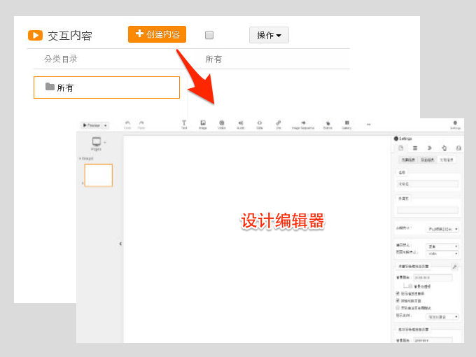
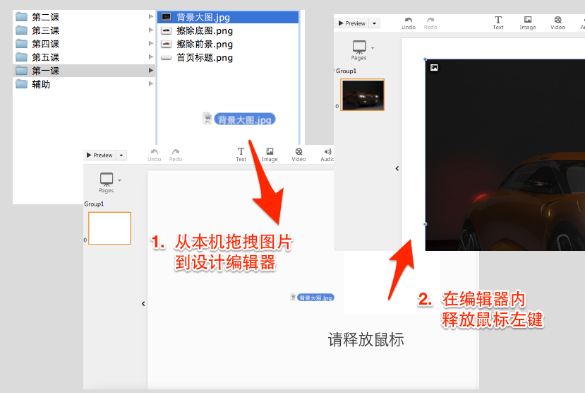

# 第一课 Epub360初体验

## 创建自己的作品

登录Epub360后，点击“创建内容”按钮，即进入新作品的设计编辑器：

Epub360设计编辑器主要由：工具栏、页面管理、设计区域、属性面板四部分组成。

现在，开始创作自己的作品吧。

## 设计封面页

对于新创建的作品，系统已包含一空白页，我们利用这一页来设计制作作品封面。

### 拖拽上传图片

首先将素材包中“第一课”文件夹中“背景大图”、“首页标题”两个图片文件放置到设计区域。

Epub360支持拖拽上传图片，操作方式如下图所示：

> **提示：** 除了图片，其他资源文件（视频、音频等）同样可以通过拖拽方式上传设计区域.

### 调整层叠次序

设计区域内的对象是有层叠次序的，通常总是先插入的被置于更底层的位置。

这里需要将“首页标题”图片放置在“背景大图”上方。如果需要调整层叠次序，可以通过右边栏“属性面板”的**“层”设置面板**来调整。

常用操作包括:

| 图示       | 描述 |
| :--------:  | :--------|
| | 鼠标悬浮其上，激活设计区域内当前对象 |
| | 鼠标双击，则打开对象属性设置面板 |
| | 隐藏／显示当前对象 |
| | 删除当前对象 |
| | 可鼠标拖拽调整层叠次序 |

### 预览效果

用鼠标拖放调整两张图片的位置后，就点击左上角的 **预览** 按钮看看效果了。

> **提示：** 在设计过程中，随时预览随时调整，这将是最常经常用的一个功能。

### 调整图片尺寸

有没有感觉标题文字显得太大，可以按图示方法调整其显示尺寸：

### 图片放大动画

接下来，我们再给“背景大图”增加一个缓缓放大的效果，以免感觉呆板。

> 封面页内容就算设计完成了

## 图片擦除效果

### 添加第二页

### 设置擦除效果

## 展示作品

### 浏览器内查看

### 在IPad上查看

## 重设标题封面

## 小结
