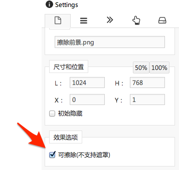

# 添加擦除效果

Epub360支持对图片设置**擦除效果**, 这将提升交互性与趣味性。

在本节中，将在刚才添加的空白页上，层叠放置两张图片，通过擦除上面一张图片，让下面的图片显现出来。

操作过程请观看视频:

<video width="90%" controls><source src="http://qn.media.epub360.com/materials/video/872a10a94bf4661d2d99a727f9c72a15.mp4?avthumb/ipad_low" type="video/mp4"></video>

关键步骤在于，设置被擦除图片支持“可擦除”:

