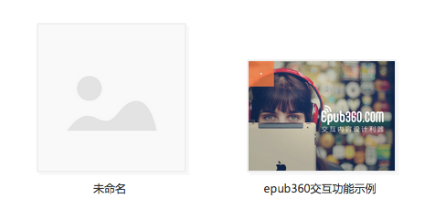

# 设置交互内容标题/封面

新创建的交互内容标题是“未命名”，并且其封面是系统缺省设置的（如图)，不直观也不美观。

如何设置标题封面呢？请观看视频了解操作方法：

<video width="90%" controls><source src="http://qn.media.epub360.com/materials/video/db64a9e3b219531ce43e22148fac670b.mp4?avthumb/ipad_low" type="video/mp4"></video>
