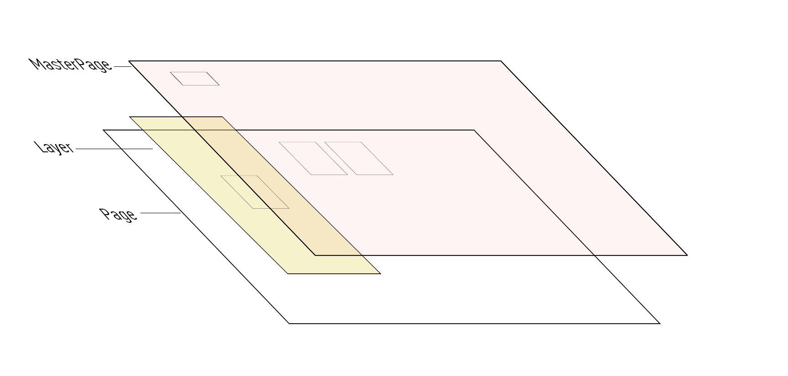

# Page/Layer/MasterPage

到现在，我们已经接触了 Page / Layer / Master Page 这三种页面类型，他们之间到关系如图所示:

|名称|说明|
|:---|:---|
|Page|交互内容页，是图片等素材对象的容器、以及交互内容的组织单元|
|Layer|可以作为素材对象的容器，类似于Page，只能插入Page／Master Page，无法独立使用，|
|MasterPage|全局页面容器，叠加在Page上，一般用于全局导航、全局背景音乐等|
