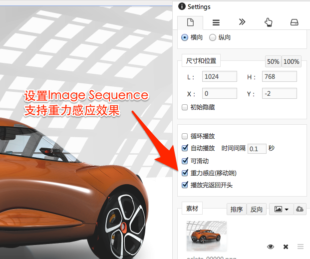

# 使用重力感应

> 提示: 本节讲解内容需要使用iPad配合展示......

Epub360支持设置重力感应效果，我们在 **第二课/使用Image Sequence** 所完成内容的基础上，尝试使用并查看效果:

<video width="100%" controls><source src="http://qn.media.epub360.com/materials/video/0bb251eb8a3a30d07a4911933df1f4ed.mp4?avthumb/ipad_low" type="video/mp4"></video>

关键步骤在于，设置Image Sequence支持“重力感应”:

Epub360中支持**重力感应**的还有：

- 图片支持遮罩后，可设置支持重力感应
- Layer组件

重力感应展示效果如何，与内容本身密切相关，为了达到好的效果，可能需要反复调整和测试。

具体来说，有关的因素包括：

- Image Sequence的帧数
- Layer组件与Layer内容的大小尺寸及差异
- Image尺寸与遮罩区域尺寸的大小及差异

