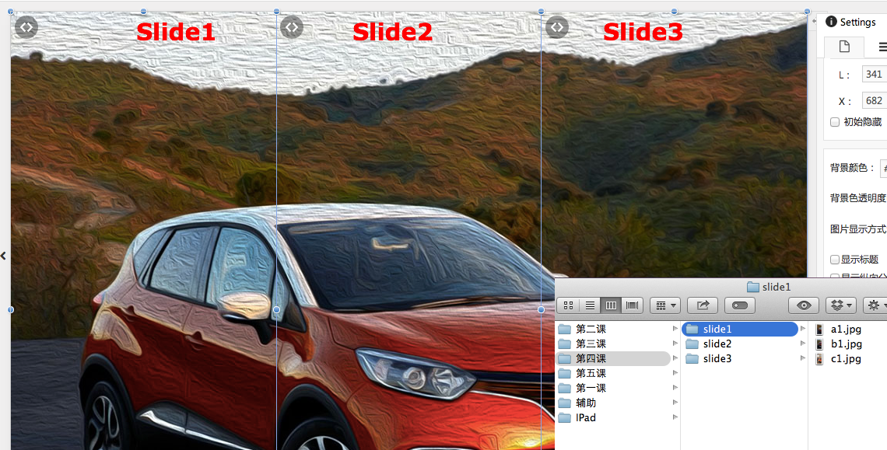

# 使用Binding

Binding用于关联多个对象，使得其中一个对象的动作，会带动其他关联对象做出相应的动作。

这里使用素材包 **第四课**里Slide1、Slide2、Slide3三个文件夹里的图片，分别创建三个Slide（如图）

完成3个Slide的制作后，观看视频，了解Binding的使用以及效果:

<video width="90%" controls><source src="http://qn.media.epub360.com/materials/video/84154a98c4f4991270aff58cb365f17d.mp4?avthumb/ipad_low" type="video/mp4"></video>

Epub360中Binding的应用场景包括：

- **多个Layer间**

  不同Layer的长度／宽度不同，Binding后的移动可以形成视差效果
- **多个Slide/Image Sequence/Layer Slide间**

  可以形成联动效果

