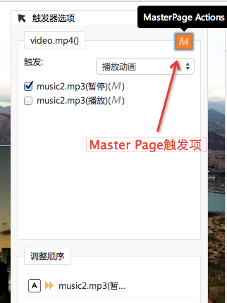

# 控制背景音乐

视频播放会与全局背景音乐冲突，在播放视频的时候，有没有办法暂停背景音乐呢？

<video width="100%" controls><source src="http://qn.media.epub360.com/materials/video/1a54be2a3fb90c53647eebf38c946c83.mp4?avthumb/ipad_low" type="video/mp4"></video>

视频总长1m51s，要点如下：

- 在Master Page中，给背景音乐Audio添加：**暂停动画**、**播放动画**
- 在Page中，给视频的播放动画，添加动画触发器 @ 44s
  - **动画onStart时**：视频播放开始，触发暂停MasterPage中的背景音乐
  - **动画onEnd时**：视频播放结束，触发播放背景音乐

关键步骤在于触发Master Page中的Audio播放／暂停动画（如图）：

这样就解决了视频和背景音乐的冲突问题。

